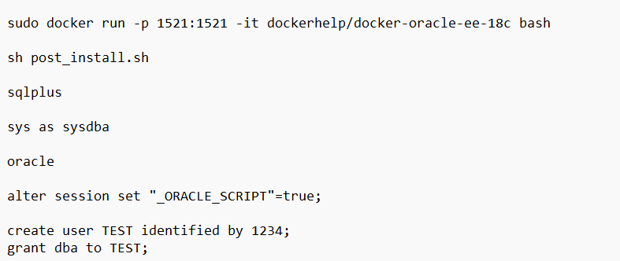

Universidad de San Carlos de Guatemala

Facultad de Ingeniería

Escuela de Ciencias y Sistemas

SISTEMA DE BASES DE DATOS 1

Primer Semestre 2023

# 
**MANUAL TECNICO**

## **FUNCIONAMIENTO GENERAL**
SE TRABAJO CON AYUDA DE UNA MAQUINA VIRTUAL EJECUTADA DESDE GOOGLE CLOUD Y CONFIGURADA CON AYUDA DE LA HERRAMIENTA TERMIUS PARA ASI EJECUTAR UN DOCKER EN EL CUAL SE TENDRIA REGISTROS DE UNA BASE DE DATOS PRINCIPAL PARA EL MANEJO DL SISTEMA DE SALUD DEL GOBIERNO CHINO ACERCA DEL CONTROL DE INFECCIONES. Además se hizo la coneccion entre esta instancia virtual en la nube y una api que consumiria las consultas segun el modelo previamente estructurado.

Para ello necesitamos instalar y configurar docker con un usuario y Grant, esto para ubicar de mejor manera nuestros recursos.

La base de datos tiene una estructura en la cual se utilizan 5 tablas principales y 3 tablas intermedias, que vienen siendo el esqueleto de la base de datos. Las entidades principales son: Victima, Hospital, Tratamiento, Ubicacion y Asociado; y las tablas intermedias que funcionan para eliminar nuestra relacion de muchos a muchos entre las principales son: Victima_Tratamiento, Victima_Asociado, Victima_Ubicacion. Teniendo como tala central a la entidad Victima y las demas segun corresponda van ubicadas cada vez más "a las ramas". Para la coneccion entre este y la herramienta visual Dbeaver colocamos el usuario y contraseña anteriores y la IP publica de nuestra instancia en la nuve,  de la siguiente forma:

## **EXPRESS-MYCONNECTION**

La librería "express-myconnection" es un middleware para el framework de aplicaciones web "Express" en Node.js que facilita la gestión de conexiones a bases de datos en una aplicación.

Con "express-myconnection", puedes establecer y administrar fácilmente conexiones a bases de datos en tu aplicación Express sin tener que escribir la lógica de conexión y desconexión cada vez que se realiza una operación en la base de datos. Esta librería proporciona una manera sencilla de crear y utilizar conexiones de base de datos para bases de datos MySQL, PostgreSQL, SQLite y MSSQL. También puede utilizarse para manejar transacciones y liberar recursos de conexión automáticamente.

En resumen, "express-myconnection" te permite simplificar el manejo de la conexión a bases de datos en tus aplicaciones Node.js con Express, lo que puede ahorrar tiempo y reducir la cantidad de código necesario para realizar operaciones en la base de datos.

## **ORACLEDB**

La librería "oracledb" es un módulo para Node.js que permite a los desarrolladores conectarse y comunicarse con bases de datos Oracle utilizando JavaScript. Esta librería ofrece un conjunto completo de funciones y métodos para interactuar con bases de datos Oracle, incluyendo la ejecución de consultas, actualizaciones y eliminaciones, así como la recuperación y procesamiento de datos.

La librería "oracledb" proporciona una forma rápida y eficiente de interactuar con bases de datos Oracle desde una aplicación Node.js. También ofrece características avanzadas como la compatibilidad con múltiples versiones de Oracle, soporte para operaciones asincrónicas y un conjunto completo de características de seguridad.

Además, "oracledb" está diseñada para ser altamente escalable y de alto rendimiento, lo que significa que puede manejar grandes volúmenes de datos y múltiples usuarios sin sacrificar la velocidad o la estabilidad. En resumen, la librería "oracledb" es una herramienta esencial para cualquier desarrollador de Node.js que necesite interactuar con bases de datos Oracle en su aplicación.

Para que la coneccion entre los puntos expuestos y la API se ejecutan lo que son endpoints y estos llamaran a ciertas funciones encargadas de ejecutar los Querys necesarios para generar la salida solicitada, Estos se capturan en una variable que es capaz de comprender filas y columnas. Para por medio de un ciclo foreach asignarlos a una tabla dentro de un archivo html el cual se escribira con ayuda de la libreria fs y cli-table. 
Ademas se ejecuta como paso 0 la creacion de una tabla temporal que almacenara todos nuestros datos en la base de datos y que nos ayudara para la insercion de los datos de una manera mas ordenada en las demas tablas. Al tener la tabla creada, debemos llenar la informacion con ayuda del archivo "archivo.ctl" que guarda las configuraciones y ciertas instrucciones para pasar toda la informacion desde un archivo csv a nuestra base.

El codigo se ejecuta con la libreria exec. La librería "exec" es un módulo incorporado en Node.js que permite ejecutar comandos en la línea de comandos del sistema operativo.

Este módulo proporciona una forma sencilla de ejecutar comandos del sistema operativo en Node.js. El método principal del módulo es "exec()", que acepta una cadena que representa el comando que se debe ejecutar y un callback que se llamará cuando se complete la ejecución del comando.

El método "exec()" ejecuta el comando y devuelve su salida a través del callback. La salida puede ser capturada y procesada por la aplicación, lo que la convierte en una herramienta útil para automatizar tareas del sistema y procesar la salida de los comandos. El módulo "exec" también proporciona otros métodos, como "execFile()", "spawn()", y "fork()", que proporcionan diferentes formas de ejecutar comandos en Node.js. Cada método tiene sus propias características y se adapta mejor a diferentes casos de uso.

En resumen, la librería "exec" es una herramienta esencial para cualquier desarrollador de Node.js que necesite ejecutar comandos del sistema operativo desde su aplicación.

Tomando como ejemplo la consulta 1:

Este código ejecuta una consulta SQL en una base de datos y luego formatea los resultados en una tabla utilizando la librería "table". La consulta SQL selecciona el nombre del hospital, su dirección y el número de fallecidos en ese hospital. La consulta se realiza mediante una conexión a la base de datos.

La función "await" se utiliza para esperar a que la consulta se complete antes de continuar con la ejecución del código. Después de ejecutar la consulta, los resultados se almacenan en la variable "results", y se utiliza la librería "table" para formatear los resultados en una tabla con tres columnas: "HOSPITAL", "DIRECCION" y "FALLECIDOS".

La tabla resultante se muestra en la consola o se almacena en una variable para su posterior procesamiento o visualización.

